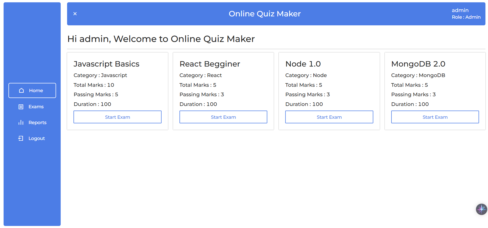

# GrowthLink Quiz
## 📖 Project Overview
GrowthLink Quiz is a full-stack web application designed to offer interactive quiz-taking functionality. It provides users with an easy-to-use interface to attempt various quizzes and tracks their performance. Built using the MERN stack (MongoDB, Express.js, React.js, Node.js), the app features secure authentication, dynamic quiz management, and responsive design. The project demonstrates strong separation of concerns with clearly structured frontend and backend codebases, making it scalable and easy to maintain.

## 📌 Task Objectives

- Develop a full-stack Quiz Application.
- Implement separate **Frontend** and **Backend** folders for clean structure.
- Provide a simple and interactive UI for users to attempt quizzes.
- Handle quiz data and user authentication via backend API.

---

## 🛠️ Tech Stack Used

- **Frontend:** React.js, Tailwind CSS
- **Backend:** Node.js, Express.js
- **Database:** MongoDB
- **Authentication:** JWT

---

## 🚀 Steps to Run the Project

### 1️⃣ Clone the Repository

```bash
git clone https://github.com/Manish3Air/GrowthLink-Quiz.git
cd GrowthLink-Quiz
```

### 2️⃣ Install Dependencies
 Backend:
```bash
cd Backend
npm install
```
Frontend:
```bash
cd ../Frontend
npm install
```
### 3️⃣ Environment Variables
Create a .env file in the Backend folder and add:
```
MONGO_URI=your_mongo_connection_string
JWT_SECRET=your_secret
PORT=5000
```
### 4️⃣ Start the Servers
Backend:
```bash
npm start
```
Frontend:
```bash
npm start
```
### 5️⃣ Access the App
```
Frontend: http://localhost:3000
Backend API: http://localhost:5000
```

## 📸 Screenshots

### Admin Home Page


### User Home Page


### Login Page


### Quiz Home Page

